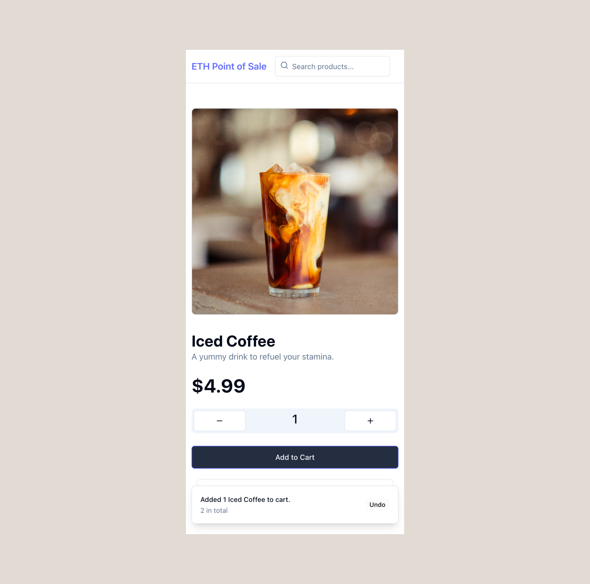

# ETH Point of Sale

## The Simple Onchain Store System




A project to practice my Foundry, Viem and Vite frontend skills.

### Features

#### Store Management

1. ##### Seed Your Inventory with JSON

    ```solidity
    // SPDX-License-Identifier: MIT
    pragma solidity ^0.8.18;

    import {Script, console} from "forge-std/Script.sol";

    contract Seed is Script {
        function getData() public view returns (bytes memory, bytes memory, bytes memory) {
            string memory root = vm.projectRoot();
            string memory path = string.concat(root, "/test/fixtures/seed.json");
            string memory json = vm.readFile(path);

            bytes memory products = vm.parseJson(json, ".products");
            bytes memory saleItem = vm.parseJson(json, ".saleItems");
            bytes memory sales = vm.parseJson(json, ".sales");
            return (products, saleItem, sales);
        }
    }
    ```

2. ##### CRUD Your Products

    1. **CREATE**

        1. At Deployment:

            ```solidity
            /// @notice Contract constructor
            /// @param _priceFeed Address of the price feed contract
            /// @param _initialProducts Array of initial products to add
            constructor(address _priceFeed, Store.Product[] memory _initialProducts) {
                s_owner = msg.sender;
                s_priceFeed = AggregatorV3Interface(_priceFeed);

                for (uint256 i = 0; i < _initialProducts.length; i++) {
                    addProduct(
                        i + 1,
                        _initialProducts[i].price,
                        _initialProducts[i].stock
                    );
                }
            }
            ```

        2. After Deployment:

            ```solidity
            /// @notice Adds a new product to the store
            /// @param _id Product ID
            /// @param _price Product price
            /// @param _stock Product stock
            function addProduct(
                uint256 _id,
                uint256 _price,
                uint256 _stock
            ) public onlyOwner inactiveProduct(_id) {
                s_products[_id] = Store.Product(_price, _stock);
                s_productActive[_id] = true;
                s_productCount++;
            }
            ```

    2. **READ**

         ```solidity
         /// @notice Retrieves a product by ID
         /// @param _productId Product ID
         /// @return product The product details
         function getProduct(
             uint256 _productId
         )
             public
             view
             activeProduct(_productId)
             returns (Store.Product memory product)
         {
             return s_products[_productId];
         }
        ```

        - Use `make get id=<ID>` to get the product with `ID`:

            ```bash
            make get ID=1

            // Output:
            0x00000000000000000000000000000000000000000000000000000000000001f30000000000000000000000000000000000000000000000000000000000000032
            ```

    3. **UPDATE**

        ```solidity
        /// @notice Updates an existing product
        /// @param _id Product ID
        /// @param _price New product price
        /// @param _stock New product stock
        function updateProduct(
            uint256 _id,
            uint256 _price,
            uint256 _stock
        ) public onlyOwner activeProduct(_id) {
            s_products[_id] = Store.Product(_price, _stock);
        }
        ```

        - Use `make update id=<ID> price=<PRICE> stock=<STOCK>` to update the product with `ID`:

            ```bash
            make get ID=1

            // Output:
            0x00000000000000000000000000000000000000000000000000000000000001f30000000000000000000000000000000000000000000000000000000000000032
            ```
